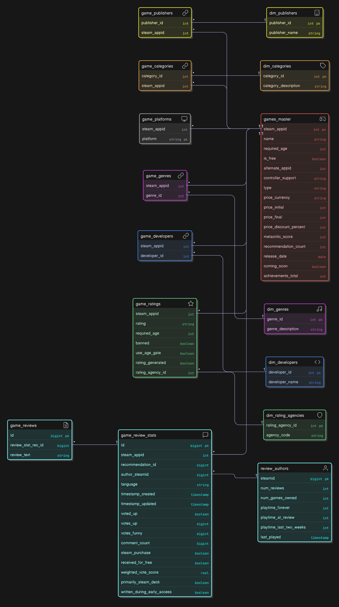

# Data Warehouse Project
This is a personal project developed to explore data engineering practices using real-world data from the Steam API.  
It serves as a hands-on case study in building reliable, auditable data pipelines.  
It demonstrates:
  - Scalable ingestion of large semi-structured datasets (~20,000 JSON files)
  - Application of the Medallion Architecture
  - Robust data validation, referential integrity, and ETL workflows
  - Preparation of a clean analytical dataset suitable for dashboards and business intelligence use cases
    
# 1. Data Architecture

## Data Sources  
- **~20,000 JSON files** pulled from the Steam API  
- Pre‑organized into **batches of 300 files** each to simplify ingestion and parallel processing  

## Bronze Layer  
- **Raw JSON** persisted exactly as received  
- **Batch metadata** and **error logs** maintained in `bronze.load_log`  
- Acts as the **immutable audit trail** for every downstream transformation  

## Silver Layer  
- Data is **cleaned**, **validated**, and **normalized**  
- **Referential integrity** enforced via foreign keys  
- Schema broken into:  
  - **Dimension tables**
  - **Bridge tables** (many‑to‑many mappings)  
  - **Fact tables**

## Gold Layer  
- **Denormalized**, **aggregated** tables designed for:  
  - **Analytics** (ad‑hoc SQL, BI queries)  
  - **Dashboards** (fast filtering, charting)  
  - **Reporting** (scheduled exports, executive summaries)  
- Optimized for **read performance** and **simplicity**  

---

# 2. Data Flow / ETL Pipeline

## 2.1 Source  
- JSON files (game details, reviews, author metadata, price, etc.) auto‑fetched from Steam’s API  

## 2.2 Ingestion (Bronze)  
- **Python ETL job**:  
  1. Check individual JSON file size (jsonb accepts 256MiB MAX)
  2. Splits JSON files into batches.
  3. Reads batches of 300 JSON files  
  4. Inserts raw payload into `bronze.steam_app_details`  
  5. Records success/failure and error messages in `bronze.load_log`  

## 2.3 Transformation (Silver)  
- **Normalization**: unpacks nested JSON into separate tables  
  - **Core game**: `silver.games_master`  
  - **Dimensions**:  
    - `silver.dim_publishers`  
    - `silver.dim_categories`  
    - `silver.dim_genres`  
    - `silver.dim_developers`  
    - `silver.dim_rating_agencies`  
  - **Bridges/Facts**:  
    - `silver.game_publishers`  
    - `silver.game_categories`  
    - `silver.game_genres`  
    - `silver.game_developers`  
    - `silver.game_ratings`  
    - `silver.game_platforms`  
    - `silver.review_authors`  
    - `silver.game_review_stats`  
    - `silver.game_reviews`  
- **Data Quality**:  
  - Null / duplicate detection  
  - Value‑range validation (e.g. price, scores)  
  - Orphan foreign‑key discovery  
- **Integrity**: deduplication, foreign‑key enforcement, controlled truncates & reloads  

## 2.4 Data Model for Silver Layer

## 2.5 Materialization (Gold – Analytics‑Ready)  
- **Denormalization** of dimensions into arrays or JSON columns  
- **Aggregations** for high‑level KPIs:  
  - Review counts & averages (`gold.review_summary`)  
  - Genre/category distributions (`gold.games_enriched`)  
- **Final tables** optimized for rapid dashboard queries  

---

### Privacy & Ethics
- Review authors' SteamIDs are handled strictly for referential integrity.
- No personal data beyond public Steam review content is processed.
