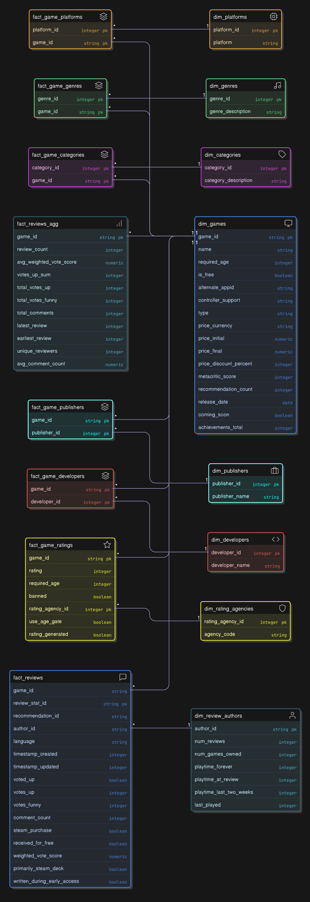

# Data Warehouse Project
This is a personal project developed to explore data engineering practices using real-world data from the Steam API.  
It serves as a hands-on self-study in building reliable, auditable data pipelines.  
It demonstrates:
  - Scalable batch ingestion of large semi-structured datasets: That is ~20,000 JSON files.
  - Application of the Medallion Architecture: From Bronze -> Silver -> Gold
  - Robust data validation, referential integrity, and ETL workflows that produce clean, normalsied, query-optimsied tables
  - Final outputs designed for BI tools (Tableau, Power BI)  

### Privacy & Ethics
- Review authors' SteamIDs are handled strictly for referential integrity.  
- No personal data beyond public Steam review content is processed.  

# Repo Structure (High-Level)
.
├── etl/                  # Python scripts for ingestion and transformation
├── docs/                 # Diagrams and documentation assets
├── sql/                  # SQL models and DDL/DML scripts
├── bronze/               # Raw data layer (JSONB)
├── silver/               # Clean, normalized schema
├── gold/                 # BI-ready outputs
└── README.md
